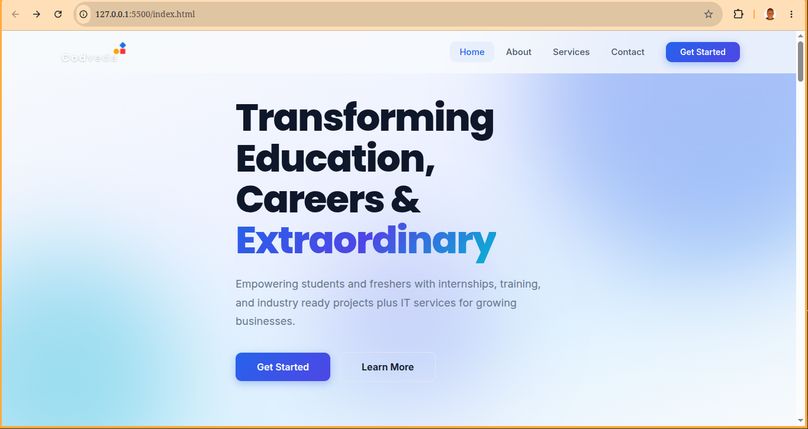
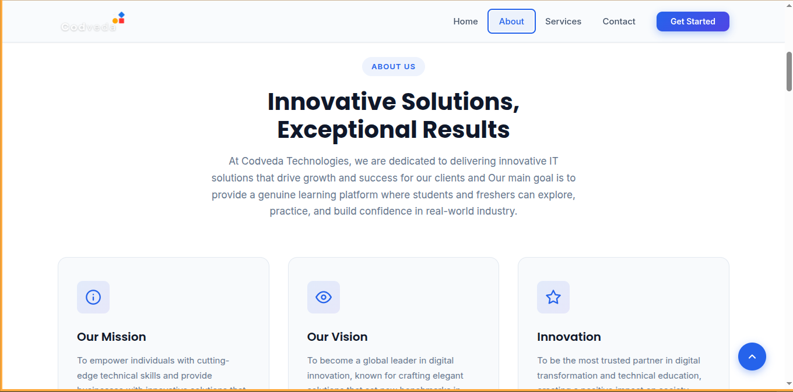
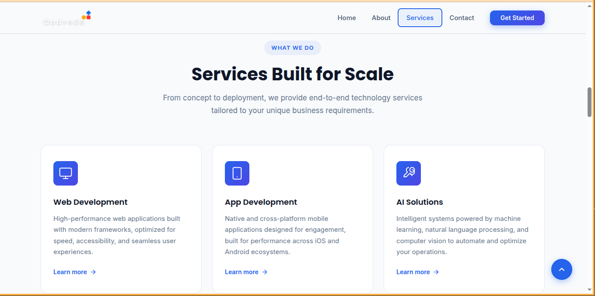
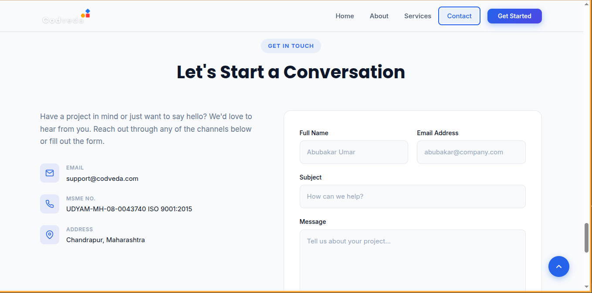

# Codveda Technologies - Responsive Landing Page

A modern, responsive landing page built as part of my Front-End Development Internship at Codveda Technologies.

The project showcases responsive web design, semantic HTML, modern CSS, and interactive JavaScript while delivering a clean and user-friendly experience across different devices.

## Project Overview

This landing page was designed to represent a modern technology company. It includes multiple sections such as Hero, About, Services, Testimonials, Contact, and Footer, with smooth navigation and responsive layouts.

The project was built using only HTML, CSS, and Vanilla JavaScript.

## Features

- Responsive Navigation Bar
- Hero Section
- About Section
- Services Section
- Statistics Section
- Testimonials
- Contact Form with Validation
- Sticky Navigation
- Smooth Scrolling
- Mobile Navigation Menu
- Back to Top Button
- Responsive Design
- Modern UI/UX

##  Technologies Used

- HTML5
- CSS3
- JavaScript (ES6)
- CSS Flexbox
- CSS Grid

## Project Structure

codveda-landing-page/
│
├── index.html
├── css/
│   ├── style.css
│   └── responsive.css
├── js/
│   └── script.js
├── assets/
│   ├── images/
│   └── icons/
└── README.md

##  Responsive Design

The website is optimized for:

- Mobile Devices
- Tablets
- Laptops
- Desktop Screens

##  Live Demo

https://codveda-technology.vercel.app

## GitHub Repository

https://github.com/sadikumar6413/codveda-technology.

## Screenshots

A

## Learning Outcomes

This project helped me strengthen my understanding of:

- Semantic HTML
- Responsive Web Design
- CSS Flexbox & Grid
- JavaScript DOM Manipulation
- Form Validation
- User Interface Design
- Mobile-First Development

## Author

Abubakar Umar

Front-End Developer

GitHub: https://github.com/sadikumar6413

LinkedIn: https://www.linkedin.com/in/abubakar-umar-847b04402/

## License

This project was created for educational and internship purposes.
